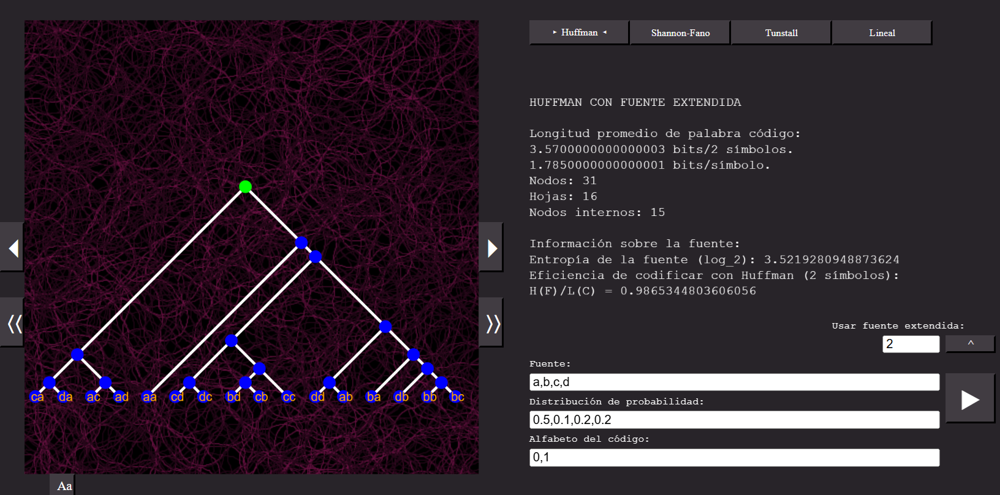

# DuKod
Proyecto de teoría de códigos y a la teoría de la información.
Permite visualizar, jugar con algunos conceptos introductorios de teoría de la codificación, como la construcción de árboles de codificación para los algoritmos de Huffman y de Shannon-Fano, el cálculo de entropías, o la detección de errores usando códigos lineales.

## Powered by p5.js

Una versión en linea se puede encontrar [aqui](https://editor.p5js.org/jmartinezcas/full/0DYHE_9rN).

